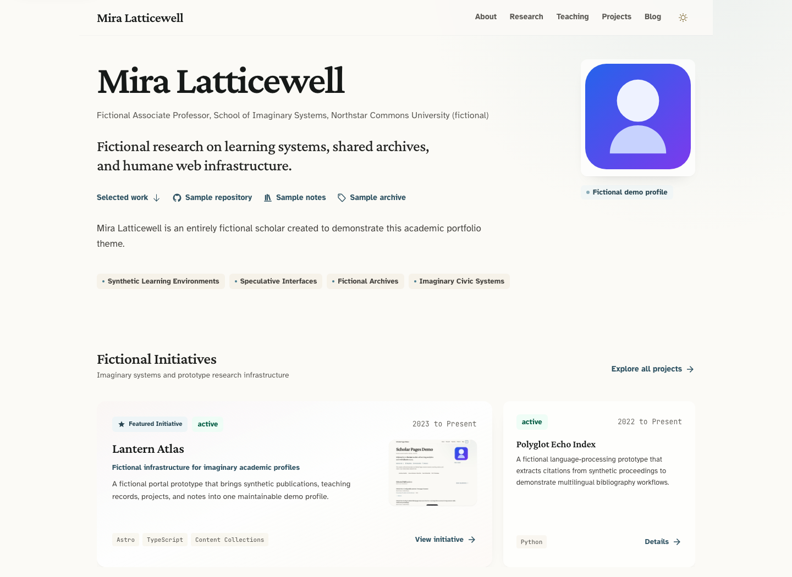
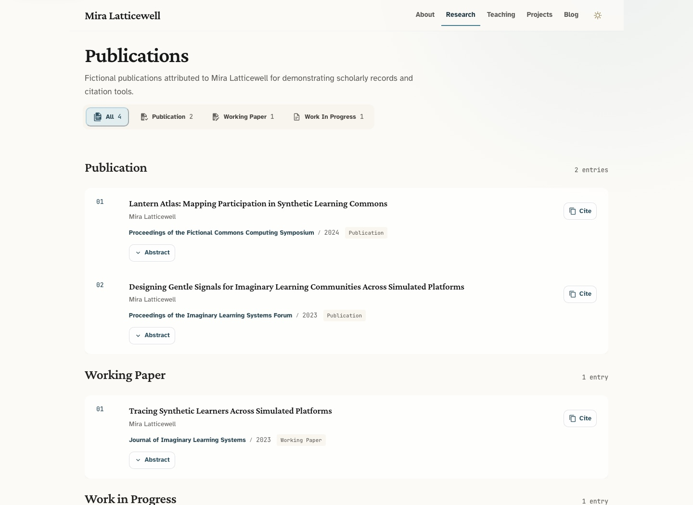

[English](./README.md) · [简体中文](./README.zh-CN.md)

# Scholar Pages

An Astro template for academic websites, with pages for your profile, publications,
projects, teaching, and blog. Edit your details in TypeScript, BibTeX, YAML, and
Markdown; routine content updates don't require changes to the page components.



## Highlights

- Filter publications, expand abstracts, and copy BibTeX, APA 7, Chicago, or Harvard citations.
- Feature blog posts, add optional covers, and show reading time automatically.
- Choose which home-page sections appear in `site.config.ts`.
- Responsive layouts with light and dark modes, keyboard focus states, and accessible native controls.
- Built-in canonical URLs, Open Graph, JSON-LD, sitemap, `robots.txt`, and template update PRs.

<details>
<summary>More previews: blog and publications</summary>




</details>

## Quick start

Install [Node.js](https://nodejs.org/) 22.13+ and [pnpm](https://pnpm.io/) 11+.

### 1. Create your site

Click [**Use this template**](https://github.com/jxpeng98/astro-theme-scholars/generate)
to create your own repository. Replace `your-handle` with your GitHub username
and `your-site` with your repository name in both commands below:

```bash
git clone https://github.com/your-handle/your-site.git
cd your-site
pnpm install
pnpm dev
```

Open [http://localhost:4321](http://localhost:4321) to preview the site.

<details>
<summary>Create from the command line</summary>

```bash
pnpm create astro@latest my-scholar-site --template jxpeng98/astro-theme-scholars
cd my-scholar-site
pnpm install
pnpm dev
```

</details>

### 2. Add your content

Start with `author`, `siteUrl`, and `hero` in [site.config.ts](./site.config.ts).
Replace `public/profile.svg` with your portrait, or point `hero.profileImage` to
your image. Then replace the entries and covers listed in [Where to edit](#where-to-edit).
The Mira Latticewell profile, institutions, and all sample content are fictional.
Remove or replace them before publishing.

### 3. Deploy

Set `siteUrl` to your public website address, then run:

```bash
pnpm verify
```

This runs tests, type checks, and content checks, and builds the site into `dist/`.
Deploy that folder to Cloudflare Pages, Vercel, Netlify, GitHub Pages, or another
static host. If your host builds the site, use `pnpm build` as the build command
and `dist` as the output directory.

#### GitHub Pages

To publish at `https://serml.github.io/`, first rename this repository to
`serml.github.io` in **Settings → General → Repository name**. Then open
**Settings → Pages**, set **Build and deployment → Source** to **GitHub Actions**,
and push to `main` or run **Deploy to GitHub Pages** from the Actions tab. The
workflow builds the site at the domain root. If you use a different domain,
update `siteUrl` in `site.config.ts` to match.

**Building and deploying don't require the Actions PR permission.** Enable it
only if you want the default [automatic template updates](#template-updates).

## Where to edit

| Content | File or folder |
| --- | --- |
| Name, affiliations, links, SEO, and page introductions | `site.config.ts` |
| Publications and working papers | `src/data/publications.bib` |
| Biography, experience, education, service, and awards | `src/data/about.yml` |
| Projects | `src/content/projects/` — one `.md` file per project |
| Teaching | `src/content/teaching/` — one `.md` file per course |
| Blog posts and research notes | `src/content/posts/` — `.md` or `.mdx` files |
| Portrait, favicon, and other static files | `public/` |
| Project, teaching, and post covers | `src/assets/` |
| Colors, typography, icons, and shared styles | `uno.config.ts` |

### Site configuration

Edit the existing [site.config.ts](./site.config.ts): `affiliations` lists your
appointments, `researchInterests` your interests, and `socialLinks` your profile
links. Use `homeBlocks` to show or hide the profile, projects, publications, and
posts, or change their section headings. `defineSiteConfig` supplies defaults
for navigation, page titles, footer text, image dimensions, and section labels.

`siteUrl` is used for canonical and Open Graph URLs, `robots.txt`, and the sitemap.

## Managing content

### Publications

Add BibTeX entries to [src/data/publications.bib](./src/data/publications.bib).
The extra `public` field controls the group on the Research page:

| `public` value | Group |
| --- | --- |
| `yes` | Publication; eligible for the home-page selection |
| `wp` | Working Paper |
| `wip` | Work in Progress |
| Other or omitted | Other |

Add `abstract` for an expandable abstract and `url` to link the title and PDF button.
Cite offers BibTeX, APA 7, Chicago, and Harvard formats. BibTeX export preserves
capitalization braces, DOI, volume, issue, pages, and custom fields; comments
between entries are supported. Wrap institutional authors in extra braces, as in
`author = {{Research and Policy Group} and de la Cruz, Juan}`, and define `@string`
macros before using them. Check specialized entry types and LaTeX commands before
using formatted citations in a submission.

### About

Edit [src/data/about.yml](./src/data/about.yml). Entries appear in file order;
remove a top-level list or set it to `[]` to hide a block. Empty optional records
are ignored. Custom sections can hold awards or talks; the first appears beside
Service on wide screens. Change the page title and introduction in `site.config.ts`.

### Projects, teaching, and posts

Copy an existing entry in `src/content/` and edit its YAML frontmatter and Markdown
body. Posts also support MDX. See the [content authoring guide](./docs/content-authoring.md)
for field examples, covers, links, and migration from the old project and teaching YAML files.

- Filenames determine detail URLs. Subfolders work too: `posts/2026/note.mdx`
  becomes `/posts/2026/note`; existing single-file URLs stay the same.
- Use `links` for external project or course resources. Fields are checked at build time.
- Set `draft: true` to hide an entry. The newest published post marked
  `featured: true` leads the blog; otherwise, the newest published post does.
- Post covers use `heroImage` and require `heroImageAlt`. Project and course
  covers use `cover` and `coverAlt`. Remove the image fields if you don't want a cover.
- Covers become responsive WebP images; cards without covers use the available
  width. Post reading time is calculated automatically.

## Included pages

| Route | Content |
| --- | --- |
| `/` | Profile, featured projects, selected publications, and recent posts |
| `/about` | Biography, experience, education, service, and custom sections |
| `/researches` | Publications grouped by status, with filters |
| `/teaching` | Current and past teaching grouped by term |
| `/teaching/[...slug]` | Course details and external resources |
| `/projects` | Active and past projects, metadata, and links |
| `/projects/[...slug]` | Project details and external resources |
| `/posts` | Featured post and blog archive |
| `/posts/[...slug]` | Article, reading information, and sharing links |

Page code lives in `src/pages/`, shared components in `src/components/`, and
layouts in `src/layouts/`. Configuration defaults are in `src/config/`; content
and SEO helpers are in `src/lib/`. Preview images live in `docs/screenshots/`.
Astro settings are in `astro.config.ts`, and dependencies and commands in `package.json`.

## Commands

| Command | Purpose |
| --- | --- |
| `pnpm dev` | Start the development server |
| `pnpm build` | Build into `dist/` |
| `pnpm preview` | Preview the production build |
| `pnpm test` | Run unit tests |
| `pnpm astro check` | Check Astro and TypeScript |
| `pnpm test:content` | Check nested routes, MDX, drafts, missing covers, and empty content |
| `pnpm test:browser` | Check interactions in Chromium, Firefox, and WebKit |
| `pnpm verify` | Run tests, type checks, build, generated-site assertions, and content regressions |

<details>
<summary>Running browser tests</summary>

Install the engines with `pnpm exec playwright install chromium firefox webkit`
(add `--with-deps` on Linux), then run `pnpm test:browser`.
Use `pnpm exec playwright show-report` to view results, including screenshots and
traces on failure. Tests use temporary content and a local preview, leaving your
content and `dist/` untouched. CI runs `pnpm verify` and all three browser engines.
WebKit checks don't replace Safari testing on real Apple devices.

On macOS 27, Firefox may fail to start because of an
[upstream app-data permission issue](https://bugzilla.mozilla.org/show_bug.cgi?id=2060476).
Run `pnpm test:browser --project=chromium --project=webkit` to check the other
engines; the default command and CI still require all three.

</details>

## Template updates

Updates arrive as PRs for you to review and merge. With the default GitHub token,
set up your repository once:

1. Open **Settings → Actions → General → Workflow permissions**, enable
   **Allow GitHub Actions to create and approve pull requests**, and **Save**.
2. Open **Actions → Template Update → Run workflow**. It also checks every Monday.
3. Review and merge the `chore/template-update-X.Y.Z` PR. The updater installs
   dependencies and runs `pnpm verify` before creating or updating it.

The permission in step 1 belongs to **your repository**; copying the template
doesn't enable it. New personal repositories have it turned off by default.
If PR creation fails with `GitHub Actions is not permitted to create or approve
pull requests`, enable it and rerun the failed job. See
[GitHub's permission settings](https://docs.github.com/en/repositories/managing-your-repositorys-settings-and-features/enabling-features-for-your-repository/managing-github-actions-settings-for-a-repository#preventing-github-actions-from-creating-or-approving-pull-requests).

Keep `.github/workflows/template-update.yml`, `.template-sync.json`, and
`.template-version`. Don't change `.template-version` to the target version
before updating: the updater would treat it as already installed.

Paths under `protected` in `.template-sync.json` are kept. Defaults cover site
configuration, YAML and BibTeX data, content entries, project and teaching images,
portraits, the favicon, and environment files. Other template files are replaced,
so review any custom code changes before merging. Without `TEMPLATE_UPDATE_TOKEN`,
workflow files are skipped and need manual updates.

Check `.template-version` before updating an older site: `v0.6.x` needs the
workflow replacement below; a missing version or one below `0.6.0` needs migration.

<details>
<summary>Older sites: workflow replacement and migration</summary>

**v0.6.x:** Copy `.github/workflows/template-update.yml` from `v0.7.0` into your
default branch, then follow the update steps above. The older updater can't
replace workflow files with the default token. From `v0.7.0`, it uses the target
release's migration script, so later data migrations don't need another replacement.

The `v0.7.0` migration converts `src/data/projects.yml` and `src/data/teaching.yml`
to Markdown without importing demo entries or overwriting existing Markdown.
It keeps the original YAML for comparison or rollback. Delete those files only
after checking the generated entries and pages.

**Below v0.6.0, or no `.template-version`:** Start with a clean working tree and
run the following in a Bash-compatible shell from your site's repository root,
even if an update workflow is already present. This migrates personal configuration
to `site.config.ts`, installs the compatibility entry and updater, and removes
obsolete template-owned content and robots files while preserving protected content.

```bash
git switch -c chore/template-update-v0.9.0

template_dir="$(mktemp -d)"
template_dir="$(cd "$template_dir" && pwd -P)"
git clone --depth 1 --branch v0.9.0 \
  https://github.com/jxpeng98/astro-theme-scholars.git \
  "$template_dir"

node "$template_dir/scripts/sync-template-release.mjs" \
  --source "$template_dir" \
  --target . \
  --config "$template_dir/.template-sync.json"

pnpm install --frozen-lockfile
node scripts/migrate-legacy-content.mjs
pnpm verify
git status --short
git diff
```

Review the diff, commit, and open a PR. Restore any personal files outside the
default protected paths before committing. If the script reports an unsupported
legacy configuration, migrate that file by hand instead of forcing the sync.
Later releases can use the automatic updater.

Don't merge the template with `--allow-unrelated-histories`:
[repositories created from templates have independent histories](https://docs.github.com/en/repositories/creating-and-managing-repositories/creating-a-template-repository#about-template-repositories).
Releases use SemVer tags such as `v0.9.0`.

</details>

<details>
<summary>Optional: include workflow files in updates</summary>

Changing `.github/workflows/**` requires a separate `Workflows` permission;
PR creation permission alone isn't enough. To include these files, create an
expiring fine-grained personal access token limited to your site repository with:

- `Contents: Read and write`
- `Pull requests: Read and write`
- `Workflows: Write`

Save it as the Actions secret `TEMPLATE_UPDATE_TOKEN`. The updater detects it
automatically. Never put the token in a workflow file; revoke it when no longer
needed. Organization repositories may require administrator approval.

Updaters older than `v0.7.0` still need the workflow replacement above. To keep
managing workflows manually, add `.github/workflows/**` to `protected` in
`.template-sync.json`.

GitHub documentation: [personal access tokens](https://docs.github.com/en/authentication/keeping-your-account-and-data-secure/managing-your-personal-access-tokens),
[Actions secrets](https://docs.github.com/en/actions/how-tos/write-workflows/choose-what-workflows-do/use-secrets),
and [Workflows permission](https://docs.github.com/en/apps/creating-github-apps/registering-a-github-app/choosing-permissions-for-a-github-app#choosing-permissions-for-git-access).

</details>

## Contributing

Issues and PRs are welcome. For larger changes, open an issue first to discuss
what should change and why.

<details>
<summary>Developing and releasing the template</summary>

```bash
git clone https://github.com/jxpeng98/astro-theme-scholars.git
cd astro-theme-scholars
pnpm install
pnpm dev
```

Before releasing, align the versions in `package.json`, `.template-version`, and
the latest `CHANGELOG.md` entry. Commit the reviewed changes. Replace `v0.9.0`
below with the version you're releasing:

```bash
pnpm verify
pnpm exec playwright install chromium firefox webkit
pnpm test:browser
node scripts/check-release.mjs --tag v0.9.0
git push origin main
```

Wait for **Verify** to pass on that exact commit, including all three browsers,
then tag it:

```bash
git tag -a v0.9.0 -m "v0.9.0"
git push origin v0.9.0
```

Downstream updates read Git tags directly: a failed release workflow won't hide
an already-pushed tag. The release workflow repeats site and browser checks,
then creates the GitHub Release when they pass.

</details>

## License

[MIT](./LICENSE).
